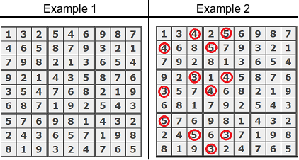

_Sudoku_ is a number-placement puzzle. The objective is to fill a `9 × 9` grid with digits so that each column, each row, and each of the nine `3 × 3` sub-grids that compose the grid contains all of the digits from `1` to `9`.

This algorithm should check if the given grid of numbers represents a correct solution to Sudoku.

**Example**

* For
```
grid = [[1, 3, 2, 5, 4, 6, 9, 8, 7],
        [4, 6, 5, 8, 7, 9, 3, 2, 1],
        [7, 9, 8, 2, 1, 3, 6, 5, 4],
        [9, 2, 1, 4, 3, 5, 8, 7, 6],
        [3, 5, 4, 7, 6, 8, 2, 1, 9],
        [6, 8, 7, 1, 9, 2, 5, 4, 3],
        [5, 7, 6, 9, 8, 1, 4, 3, 2],
        [2, 4, 3, 6, 5, 7, 1, 9, 8],
        [8, 1, 9, 3, 2, 4, 7, 6, 5]]
```

the output should be `sudoku(grid) = true`;

* For
```
grid = [[1, 3, 2, 5, 4, 6, 9, 2, 7],
        [4, 6, 5, 8, 7, 9, 3, 8, 1],
        [7, 9, 8, 2, 1, 3, 6, 5, 4],
        [9, 2, 1, 4, 3, 5, 8, 7, 6],
        [3, 5, 4, 7, 6, 8, 2, 1, 9],
        [6, 8, 7, 1, 9, 2, 5, 4, 3],
        [5, 7, 6, 9, 8, 1, 4, 3, 2],
        [2, 4, 3, 6, 5, 7, 1, 9, 8],
        [8, 1, 9, 3, 2, 4, 7, 6, 5]]
```

the output should be `sudoku(grid) = false`.

The output should be false: each of the nine `3 × 3` sub-grids should contain all of the digits from `1` to `9`.
These examples are represented on the image below.
